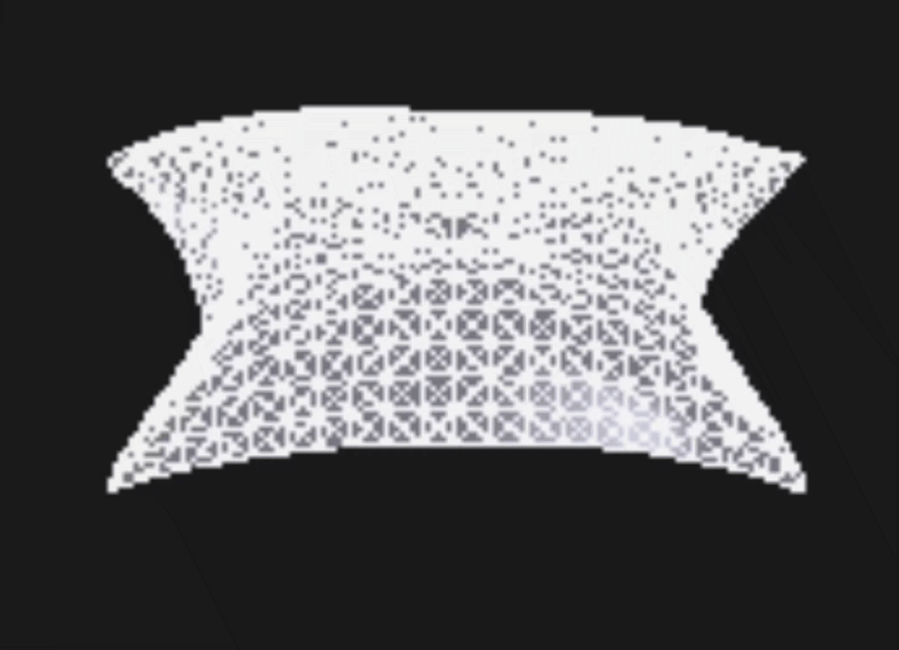

<h1>Cloth Simulation with Position Based Dynamics (WebGPU)</h1>

A real-time cloth simulation built with <strong>WebGPU</strong> and <strong>Position Based Dynamics (PBD)</strong>.  
The cloth is a square grid of triangles, pinned at its four corners, with a central vertex oscillating vertically to create visible waves.  
Gravity can be toggled via a checkbox, affecting all free vertices.

  

You can see the cloth simulation (with disabled gravity) in the picture above. Also you can see visualization in https://g30613740.github.io/cloth_sim/.

<h2>Features</h2>
<ul>
  <li>Pure WebGPU – no third-party rendering engines (Three.js, Babylon, etc.)</li>
  <li>Position Based Dynamics solver with distance constraints (horizontal, vertical, both diagonals)</li>
  <li>Verlet integration with gravity toggle</li>
  <li>4 pinned corners and a sinusoidally driven central point</li>
  <li>Real-time normal recalculation and simple Lambert shading</li>
  <li>HTML/CSS/JavaScript only – runs in a modern browser</li>
</ul>

<h2>Getting Started</h2>
<ol>
  <li>Clone the repository: 
      <code>git clone https://github.com/g30613740/cloth_sim.git</code></li>
  <li>Open <code>index.html</code> in a browser that supports WebGPU (Chrome 113+, Edge 113+, or Firefox Nightly with <code>dom.webgpu.enabled</code>).</li>
  <li>Allow the page to access your GPU.</li>
</ol>

<h2>Controls</h2>
<ul>
  <li><strong>Gravity checkbox</strong> – enables/disables downward gravity acceleration (9.8 m/s2). When off, the cloth remains flat except for the moving center.</li>
</ul>

<h2>Implementation Details</h2>
<ul>
  <li><strong>Cloth mesh:</strong> 20×20 quads, each split into two triangles.</li>
  <li><strong>PBD constraints:</strong> horizontal, vertical, and both diagonal edges; edges are shuffled for symmetric wave propagation.</li>
  <li><strong>Numerical method:</strong> Verlet integration (velocity-free) with optional gravity term.</li>
  <li><strong>Normals:</strong> computed every frame on the GPU using cross product of triangle edges.</li>
  <li><strong>Rendering:</strong> one draw call for shaded triangles (<code>triangle-list</code>), another for white wireframe lines (<code>line-list</code>). Back-face culling is disabled.</li>
  <li><strong>Coordinate system:</strong> cloth lies in the XZ plane (Y up), rotated isometrically for a 3/4 view.</li>
</ul>

<h2>License</h2>

MIT
